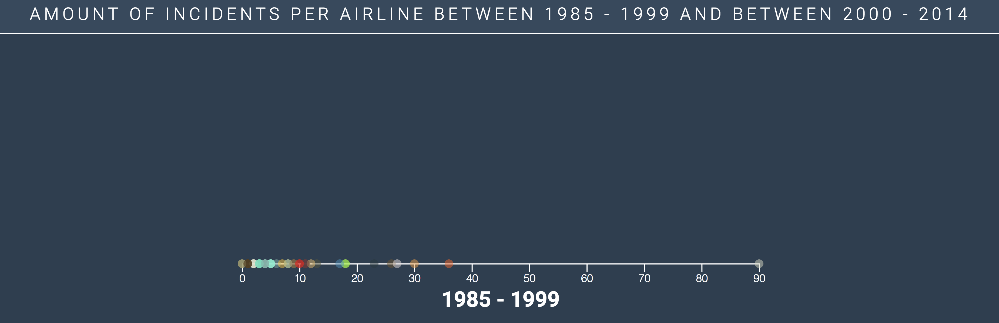

# ***Visualizing the amount of accidents with airline companies***


## ***Short description***
Creating a interactive datavisualisation that visualizes the amount of incidents with airline companies.

## ***Background*** ℹ️
This is assessement 3 of Frontend 3. I've made a D3 charts of visualsing the amount of incidents per airline between 1985 to 1999 and between 2000 and 2014. This assignment is made with __[D3](https://d3js.org/)__. I've chosen the __[Scatterplot](https://bl.ocks.org/d3noob/6f082f0e3b820b6bf68b78f2f7786084)__ and a __[Pie chart](https://bl.ocks.org/santi698/f3685ca8a1a7f5be1967f39f367437c0)__ to visualise my data. The airlines are being displayed as dots on a line. The line has ticks that show the amount of incidents. When you click on a dot it opens a pie chart to show how much percentage incident was and hoe much percentage a fatal incident. You can also see the amount of fatalities.

## ***Workflow*** 💪
* 🌬️ Clean, cleaning a bit of data and parsing the file to `.csv`.
* ⚒️ Transform, changing the examples to my code of view an load the data.
* 📊 Display, displaying the data inside the chart(s).
* 🎬 Interactive, make the chart(s) interactive with events.
* 💡 Animate, make some elements look nicer.

### ***Data*** #️⃣
The data I got from __[fivethirtyeight]__(https://github.com/fivethirtyeight/data/tree/master/airline-safety). The data contains a couple of columns which you can see below:
* Airlines, all the names of the airline company
* Availible kilometers per week, the amount of kilometers per airline
* Incidents 85-99, all incidents per airline between 1985 and 1999
* Fatal incidents 85-99, all fatal incidents per airline between 1985 and 1999
* Fatalities 85-99, all fatalities per airline between 1985 and 1999
* Incidents 00-14, all incidents per airline between 2000 and 2014
* Fatal incidents 00-14, all incidents per airline between 2000 and 2014
* Fatalities 00-14, all incidents per airline between 2000 and 2014

### ***Steps*** 🚶‍♂️
1. copying the files from the scatterplot 📁

After that I've made a directory with the following files:
* `index.html`
* `index.css`
* `index.js`
* `index.csv`
* `preview.png`

2. Loading in the data 📡

I downloaded the `.csv` file and then looked into the file. The file looked like this:

| airline | avail_seat_km_per_week | incidents_85_99 | fatal_accidents_85_99 | fatalities_85_99 | incidents_00_14 | fatal_accidents_00_14 | fatalities_00_14 |
| --------------------- | ------------- | ------ | ------ | ------ | ------ | ------ | ------ | 
| Aer Lingus            | 320906734     | 2      | 0      | 0      | 0      | 0      | 0      | 
| Aeroflot*             | 1197672318    | 76     | 14     | 128    | 6      | 1      | 88     |
| Aerolineas Argentinas | 385803648     | 6      | 0      | 0      | 1      | 0      | 0      |
| Aeromexico*           | 596871813     | 3      | 1      | 64     | 5      | 0      | 0      |
| Air Canada            | 1865253802    | 2      | 0      | 0      | 2      | 0      | 0      |

You can see that some of the airlines have a `*` in there name. And also the `avail_seat_km_per_week` is not really relevant data for me, so I also removed that data. The file was already cleaned up, but I've made some changes in it. See below:

```javascript
    // Variable doc that is the data.
    var doc = data;
    // Select header to slice. Slice the index of header.
    var header = data.indexOf("airline");
    // Select all header to slice. Add trim to remove white-space.
    var headerEnd = data.indexOf('\n', header);
    doc = doc.slice(headerEnd).trim();
    // Remove the asterisk.
    doc = doc.replace(/\*/g, '');
```
Now that I've cleaned up the data I went to map the data I want to use for the first scatterplot. You can also see the code below:

```javascript
    // Add a variable for parsing the data to an .csv file.
    var csv = d3.csvParseRows(doc, map)

    // Create a map function and declare the data and sort them too.
    function map(d) {
        return {
            airlineName: (d[0]),
            incidentsOld: Number(d[2]) + Number(d[3]),
            incidents: Number(d[2]),
            incidentsFatal: Number(d[3]),
            fatalities: Number(d[4])
        }
    }
```

I've mapped the data with names and set the number of the data to it. So I know which data I can use for the charts. `incidentsOld` has two data number combined to eachother, because I want to use that data onto the dots to show what the total incidents per aitline there are.

3. Changing the code of the scatterplot  

The scatterplot example I got has a Y-axis and a X-axis. I didn't needed a Y-axis because it was totally not relevant for my data. So I removed all the code that's relevant to the Y-axis and leaved all the code with the x-axis as it was.

To the sctatterplot I selected a ID for it to place it on that position `#first-scatter-chart` is the name of the ID. After that I noticed the x-axis line has a fixed width. I want to get that line to the full width of the browser. I made a global variable for this named: `lineWidth`. Inside the `lineWidth` I set the `window.innerWidth`. Now the line goes the width of the size the browser is!

My data contains 57 airlines, so all of them need different colors. So I was looking on the internet for coloring D3 and I've found the categorial colors from D3. Unfortunatly it only can go up to 20 colors. So that didn't worked very well. Then I've used the `d3.scaleOridal` with a `.range` to it. In the range I've put 57 hex colors (There is probably a nicer and cleaner solution, but I could not find it 😋).

I've added to the chart a tooltip where inside the tooltip you can see the total amount of incidents. I've used a example from the [bl.ocks](https://bl.ocks.org/d3noob/257c360b3650b9f0a52dd8257d7a2d73) to make a tooltip. The tooltip has a `mouseover` and a `mouseout` event. I gave to the tooltip a transition with a opacity form 0 to 1:
```javascript
    // Mouseover event where the tooltip is being added to the dots.
    // It has a transition on 0.2 seconds before it is being shown.        
    // Set in the tooltip the data of the airline name and the amount of incidents.
    .on("mouseover", function (d) {
        div.transition()
            .duration(200)
            .style("opacity", 1);
            div.html(d.airlineName + ": " + d.incidentsOld + " incidents")
                .style("left", (d3.event.pageX - 100) + "px")
                .style("top", (d3.event.pageY + 25) + "px");
    })
    // Mouseout event to remove the tooltip scatterChartWidth a opacity of 0.
    .on("mouseout", function (d) {
        div.transition()
            .duration(200)
            .style("opacity", 0);
    })
```
When I refresh the page it is really stiff (no animation at al!) so I've added a style with transition and ease to the line:
```javascript
    // Animation for the domain (axis line).
    // Select the .domain and add a styling.
    // Give transition and after that set stroke to 0.
    // Add a duration to set how long the animation runs.
    d3.select(".domain")
        .style("stroke-dasharray", lineWidth)
        .style("stroke-dashoffset", lineWidth)
        .transition()
        .duration(2000)
        .ease(d3.easeBounceOut)
        .style("stroke-dashoffset", 0);
```
Now the line has a awesome animation when refreshing the page! But the dots are still a bit stiff... I've added to the dots a delay when popping in the browser. The lines start from there starting point to there data point on the x-axis. I've added the following code to make the animation work:
```javascript
    .style("opacity", 0)
        .transition()
        .delay(function (d, i) {
            return i * 30
        })
        .style("opacity", 0.5)
```

So now it has a nice tooltip some animations and a ease! After that I made a text anchor to the chart to set the year  with an transition. I changed the font-sizes of it in CSS and renamed the font-family to `Roboto` and as a backup font: `Helvetica`.

4. Changing the code of the pie chart ⚒

So next up was to use the pie chart to show the data that is inside the `incidentsOld`. First off I copied the files from the [bl.ocks](https://bl.ocks.org/mbostock/3887235) example. The example also loads in a `.csv` file to show of the data. Fortunatly the example has also already the colors that are being used. So I first went in to see if the pie chart worked. After that I changed the colors to three kinds:
* Incidents with the color: #E67E22
* Fatal incidents with the color: #E74C3C
* Fatalities with the color: #C0392B

So now the challenge was to get the data into the pie chart when I click on a dot from the scatterplot. So I need to make a function to draw the pie chart everything I click on a dot. So now my code for my pie chart is looking like this:

```javascript
// Add the pie chart.
    function createPieChart(airline) {

        // Create a filter function to sort the data that we want into the pie chart.
        pieChartSelection = data.filter(function (d) {
            return d.airlineName == airline
        })

        // Create a object for the data we want to use in the pie chart.
        // The object contains a name which I hardcoded and the number contains the data of the incidents.
        var incidents = [{
                "name": "Incidents",
                "number": pieChartSelection[0].incidents,
            },
            {
                "name": "Fatal incidents",
                "number": pieChartSelection[0].incidentsFatal
            },
            {
                "name": "Fatalities",
                "number": pieChartSelection[0].fatalities
            }
        ]

        // Make variabele for the colors that are being shown in the pie chart.
        var pieChartcolor = d3.scaleOrdinal()
            .range(["#E67E22", "#E74C3C", "#C0392B"]);

        // Value returns the number we described in the object.
        var pie = d3.pie()
            .value(function (d) {
                return d.number;
            });

        var arc = d3.arc()
            .outerRadius(radius - 10)
            .innerRadius(0);

        var labelArc = d3.arc()
            .outerRadius(radius - 40)
            .innerRadius(radius - 40);

        var g = pieChart.selectAll(".arc")
            .data(pie(incidents))
            .attr("d", arc);

        g.enter()
            .append("path")
            .attr("class", "arc")
            .attr("d", arc)
            .style("fill", "none")
            .style("opacity", 0)
            .transition()
            .style("opacity", 1)
            .style("fill", function (d) {
                return pieChartcolor(d.data.number)
        });
    }
```

And on the dots I've made a `click` event to trigger the `createPieChart`:
```javascript
    .on("click", function (e) {
        createPieChart(e.airlineName);
    })
```

So I wil explain a bit about the code. First I needed to make an array with objects inside it to select the data I want to use in the pie chart. 

```javascript
    var incidents = [{
            "name": "Incidents",
            "number": pieChartSelection[0].incidents,
        },
        {
            "name": "Fatal incidents",
            "number": pieChartSelection[0].incidentsFatal
        },
        {
            "name": "Fatalities",
            "number": pieChartSelection[0].fatalities
        }
    ]
```
So the variabele is named incidents. It contains a name and a number. I harcoded the names because they don't need to change when I everytime click on a dot. The number I'm getting from the `pieChartSelection`. Which you can see below:

```javascript
    // Create a filter function to sort the data that we want into the pie chart.
    pieChartSelection = data.filter(function (d) {
        return d.airlineName == airline
    })
```
`pieChartSelection` is a filter function to see if the data selection of airlineName is the same to airline. Airline is again shown as a parameter inside the `createPieChart` function. 

So at the number I'm setting the `pieChartSelection` and I set the datapoint (ex: fatalities) to the number. So I can now give in the pie chart a return with d.number.

Now I'm loading the data into the pie chart, but there is ofcourse a problem. How am I going to show the amount in or outside the pie chart? Well I've made a legend for the pie chart! The legend was a bit of a struggle, because everytime when I click it also has to be updated with the new data. I used a example for the legend from [stackoverflow](https://stackoverflow.com/questions/32298837/how-to-add-a-nice-legend-to-a-d3-pie-chart) The code of the legend you can see below:
```javascript
    // How to add a nice legend to a d3 pie chart: https://stackoverflow.com/questions/32298837/how-to-add-a-nice-legend-to-a-d3-pie-chart
    // Here we create a legend for the pie chart and load the data we are using in the pie chart also.
    var legend = pieChart.selectAll(".legend")
        .data(incidents);

    g.enter()
        .append("g")
        .attr("transform", function (d, i) {
                return "translate(" + (pieChartwidth - 600) + "," + (i * 30 + 0) + ")";
        })
        .attr("class", "legend");

    legend
        .append("rect")
        .attr("width", 20)
        .attr("height", 20)
        .attr("fill", function (d, i) {
            return pieChartcolor(i);
        })
        .attr("y", -20)

    legend.append("text")
        .text(function (d) {
            return d.name + ": " + "" + d.number;
        })
        .style("font-size", 18)
        .attr("x", 35)
        .attr("y", -2);
```

I've made a variabelevor the legend and select it with a classname `.legend`. After that I used `.data` to load in the data. Then I entered the legend and gave it a transform with an attribute (which is the classname of it). A legend normally uses these things:
* Text, to show what it is and how much
* Color, to visualize the text

I appended these two things to the legend like so:
```javascript
    legend
        .append("rect")
        .attr("width", 20)
        .attr("height", 20)
        .attr("fill", function (d, i) {
            return pieChartcolor(i);
        })
        .attr("y", -20)

    legend.append("text")
        .text(function (d) {
            return d.name + ": " + "" + d.number;
        })
        .style("font-size", 18)
        .attr("x", 35)
        .attr("y", -2);
```

I append a rectangle to the legend. In the rectangle I give it a attribute with a function inside it. The function gives the same return as the `.enter` for the pie chart: `return pieChartcolor`. I've added a i parameter to it so it knows that there are more rectangles. I changed the width and height of the rectangles and also changed the y-position of it. With the text I made a function that returns the data in one string. I needed a string because if I didn't Javascript is not happy with that and it also doens't work too. I changed the font-size of the text and changed the x and y position of the text also.

5. Make de page look nice en slick 🤙

So Now that I'm done with the interaction and animations I went to style a bit the page. I gave the page a background color and a header to give the page a more look and feel to it.

## ***Thoughts*** 💭
So this assessment went for me really good. I'm still struggling with Javascript. I'm better at reading Javascript than coding it 🙄. So I hope in the near future I can create alot more cool stuff with it. The D3 documentation was also quite hard to understand. It is alot of information about it.

The subject frontend3 was an okay subject. The real problem was the time that you had to understand the D3 documentation. The time was for me also a stuggle, because I dind't have much time to understand it.

## ***Things that can lift up the quality and usability*** 🏆
* A select menu where you can choose per airline to only show that dot.
* When the pie chart is being created I could have made a animation to it (I now only have a transition!)

## ***Features***
* [D3](https://d3js.org/)
* [D3 csv](https://github.com/d3/d3/wiki/CSV)
* [D3 csvParseRows](https://github.com/d3/d3-dsv/blob/master/README.md#csvParseRows)
* [D3 map](https://github.com/d3/d3-collection/blob/master/README.md#map) 
* [D3 transition](https://github.com/d3/d3-transition/blob/master/README.md#transition)
* [D3 select](https://github.com/d3/d3-selection/blob/master/README.md#select)
* [D3 selectAll](https://github.com/d3/d3-selection/blob/master/README.md#selectAll)
* [Selection append](https://github.com/d3/d3-selection/blob/master/README.md#selection_append)
* [Selection attr](https://github.com/d3/d3-selection/blob/master/README.md#selection_attr)
* [Selection enter](https://github.com/d3/d3-selection/blob/master/README.md#selection_enter)

## ***Sources***
* [Data from fivethirthyeight](https://github.com/fivethirtyeight/data/blob/master/airline-safety/airline-safety.csv)
* [Author](https://b.locks.org/mbostock)
* [Scatterplot with v4](https://bl.ocks.org/d3noob/6f082f0e3b820b6bf68b78f2f7786084)
* [Simple Pie Chart](https://bl.ocks.org/mbostock/3887235)
* [Let's make a Pie Chart with D3.js](http://www.cagrimmett.com/til/2016/08/19/d3-pie-chart.html)
* [Simple tooltip in d3.v4](https://bl.ocks.org/d3noob/257c360b3650b9f0a52dd8257d7a2d73)
* [Axis labels in d3.v4](https://bl.ocks.org/d3noob/23e42c8f67210ac6c678db2cd07a747e)
* [D3js set x-axis tick position](https://stackoverflow.com/questions/43840134/d3js-set-x-axis-tick-position)
* [Show/ hide elements on mouse click](http://bl.ocks.org/d3noob/5d621a60e2d1d02086bf)
* [Add a transition to a D3 scatterplot](https://stackoverflow.com/questions/27950920/add-a-transition-to-a-d3j-scatter-plot)
* [How to add a nice legend to a d3 pie chart](https://stackoverflow.com/questions/32298837/how-to-add-a-nice-legend-to-a-d3-pie-chart)

## ***License***
All the rights go to [Mike Bostock](https://b.locks.org/mbostock) and [D3](https://d3js.org/). And also al rights to [@wooorm](https://github.com/wooorm) and [@Razpudding](https://github.com/Razpudding) for the example codes.

MIT © Dylan van Zanten
